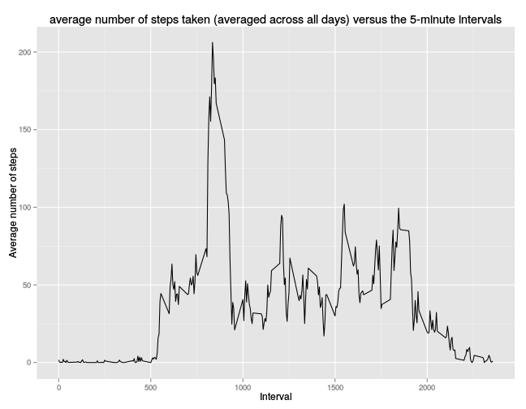

# Reproducible Research: Peer Assessment 1


## Loading and preprocessing the data

```r
activity_data <- read.csv(unz("activity.zip", "activity.csv"))
#Removing missing values
na_values <- is.na(activity_data$steps)
activity_data <- activity_data[!na_values,]
activity_data$date <- as.Date(activity_data$date)
```

## What is mean total number of steps taken per day?

```r
library(ggplot2)
histogram <- ggplot(activity_data, aes(x=date, y=steps))
histogram <- histogram + geom_histogram(stat="identity") +
             ylab("Steps") + xlab("Date") + ggtitle("total number of steps taken each day")
print(histogram)
```

 

The mean and median can be calculated in R; in order to do so, first we take the numbers of steps for each day.


```r
steps_each_day <- c()
for(day in unique(as.factor(activity_data$date))){
    stepsday <- sum(activity_data[activity_data$date == day,1])
    steps_each_day <- c(steps_each_day, stepsday)
}
```

Then we calculate the mean

```r
mean(steps_each_day)
```

```
## [1] 10766
```
Finally we calculate the median

```r
median(steps_each_day)
```

```
## [1] 10765
```
```

## What is the average daily activity pattern?


```r
steps_interval <- c()
intervals <- unique(activity_data$interval)
for(inter in intervals){
    stepsinterval <- mean(activity_data[activity_data$interval == inter,1])
    steps_interval <- c(steps_interval, stepsinterval)
}
df <- data.frame(steps=steps_interval, inter=intervals)
graph <- ggplot(df, aes(x=inter, y=steps))
graph <- graph + geom_line() + xlab("Interval") +
         ylab("Average number of steps") + ggtitle("average number of steps taken (averaged across all days) versus the 5-minute intervals")
print(graph)
```

 

The interval with the maximum number of steps on average


```r
df[which.max(df[,1]),2]
```

```
## [1] 835
```

## Imputing missing values

To calculate the total number of missing values


```r
sum(as.numeric(na_values))
```

```
## [1] 2304
```

Replacing the missing values could be done by using the mean for that 5-minute interval. Doing that, each previously missing value, now has the median of that interval across all days.


```r
new_data <- read.csv(unz("activity.zip", "activity.csv"))
for(value in 1:length(new_data[,1])){
    if(is.na(new_data[value,1])){
        inter <- new_data[value,3]
        index <- match(inter, intervals)
        new_data[value,1] <- steps_interval[index]
    }
}
```

Then it's possible to make a new histogram but with this filled data frame


```r
histogram2 <- ggplot(new_data, aes(x=date, y=steps))
histogram2 <- histogram + geom_histogram(stat="identity") +
             ylab("Steps") + xlab("Date") + ggtitle("histogram of the total number of steps taken each day after missing values were imputed")
print(histogram2)
```

 

The graph doesn't differ much at first sight. It's necessary to calculate the
mean and median for this data to be sure.


```r
new_data$date <- as.Date(new_data$date)
print(class(new_data$date))
```

```
## [1] "Date"
```

```r
steps_each_day2 <- c()
for(day in unique(as.factor(new_data$date))){
    stepsday <- sum(new_data[new_data$date == day,1])
    steps_each_day2 <- c(steps_each_day2, stepsday)
}
```

We calculate the mean

```r
mean(steps_each_day2)
```

```
## [1] 10766
```
Finally we calculate the median

```r
median(steps_each_day2)
```

```
## [1] 10766
```
```
With this new data the mean is the same as the median. The median compared to
the median of the data without missing values is almost the same. We can say
that there's no significant impact in not taken into account missing values or
replacing them.
## Are there differences in activity patterns between weekdays and weekends?


```r
days <- c("weekend", "weekday", "weekday", "weekday", "weekday", "weekday", "weekend")[as.POSIXlt(new_data$date)$wday + 1]
new_data$week <- as.factor(days)
```

Now graph steps in weekdays in contrast to steps in weekend days


```r
intervals <- unique(activity_data$interval)
steps_weekdays <- c()
steps_weekend <- c()
for(inter in intervals){
    step_weekdays <- mean(new_data[new_data$interval == inter & new_data$week == "weekday",1])
    step_weekend <- mean(new_data[new_data$interval == inter & new_data$week == "weekend",1])
    steps_weekdays <- c(steps_weekdays, step_weekdays)
    steps_weekend <- c(steps_weekend, step_weekend)
}
week <- c(rep("Weekday", length(intervals)), rep("Weekend", length(intervals)))
intervals <- c(intervals, intervals)
average <- c(steps_weekdays, steps_weekend)
df <- data.frame(Average=average, inter=intervals, Week=week)
graph2 <- ggplot(df, aes(x=inter, y=Average))
graph2 <- graph2 + geom_line() + facet_grid(Week ~ .) +
          xlab("Interval") + ylab("Average number of steps")
print(graph2)
```

 
